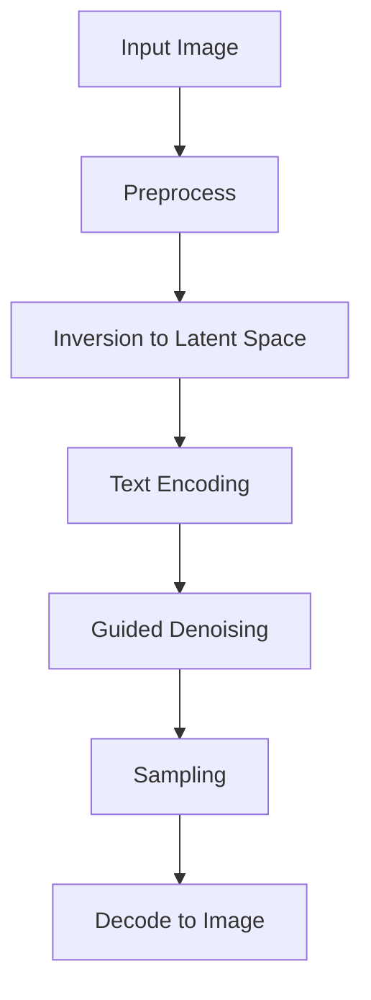

## 🎨 Text‑Based Real Image Editing Using Diffusion Models

Make realistic edits to real photos using plain‑English prompts. This project focuses on identity‑preserving, controllable edits (global and local) with minimal artifacts and high photorealism.

---

### 📚 Table of Contents
- [Overview](#-overview)
- [Key Features](#-key-features)
- [Demo](#-demo)
- [Architecture and Workflow](#-architecture-and-workflow)
- [Tech Stack](#-tech-stack)
- [Setup and Installation](#%EF%B8%8F-setup-and-installation)
- [Project Structure](#%EF%B8%8F-project-structure)
- [Data Preparation](#%EF%B8%8F-data-preparation)
- [Training and Fine‑Tuning](#%EF%B8%8F-training-and-fine%E2%80%91tuning)
- [Inference: Editing Images](#-inference-editing-images)
- [Evaluation](#-evaluation)
- [Results and Discussion](#-results-and-discussion)
- [Limitations and Future Work](#-limitations-and-%F0%9F%A7%AD-future-work)
- [Ethical Considerations](#-ethical-considerations)
- [Troubleshooting](#%EF%B8%8F-troubleshooting)
- [FAQ](#-faq)
- [References](#-references)
- [License](#-license)

---

### 🔎 Overview
Edit real images with prompts like “add black‑framed glasses,” “make the sky sunset orange,” or “change the car to red.” Under the hood, we use diffusion models (e.g., Stable Diffusion / InstructPix2Pix) with inversion, attention control, and optional ControlNet to keep identity and structure intact while applying the desired change.

---

### ⭐ Key Features
- **Text‑driven edits**: Change content/style using natural language prompts.
- **Identity preservation**: Inversion and attention control keep core content unchanged.
- **Local edits**: Use masks or attention to target regions precisely.
- **Fine control**: Adjust guidance scale, strength, sampler, and steps.
- **Modular**: Swap base models, LoRA adapters, and guidance modules.
- **Reproducible**: Seeds and deterministic samplers for consistent outputs.

---

### 🎥 Demo
Add your before/after examples here.

```text
examples/
  before_after_01.jpg
  before_after_02.jpg
```

---

### 🧭 Architecture and Workflow
High‑level workflow for editing an input image with a text instruction:



Steps in simple words:
1. **Preprocess**: Resize/normalize the photo; optionally provide a mask for local edits.
2. **Invert**: Map the real image into the model’s latent space (DDIM or Null‑Text inversion) so we can reconstruct it before editing.
3. **Encode prompt**: Turn the text instruction into embeddings (CLIP) the model can follow.
4. **Guided denoising**: Carefully denoise with CFG, attention control, and optional ControlNet/masks to apply the change without breaking structure.
5. **Sample**: Use a sampler (DDIM, Euler, DPM‑Solver) to reach the edited latent.
6. **Decode**: Convert the latent back to an RGB image with the VAE.

---

### 🧰 Tech Stack (Simple Words)
- **Python 3.10+**: Main programming language.
- **PyTorch + CUDA**: Deep learning and GPU acceleration for speed.
- **Diffusers**: Ready‑to‑use diffusion pipelines (Stable Diffusion, InstructPix2Pix, ControlNet, LoRA).
- **CLIP**: Converts your text prompt into vectors the model understands.
- **Gradio / Streamlit (optional)**: Quick web UI to try prompts and images.
- **W&B / TensorBoard (optional)**: Track experiments and sample outputs.
- **OpenCV/Pillow, NumPy, tqdm**: Image I/O, arrays, and progress bars.

Hardware:
- NVIDIA GPU with 8–12 GB VRAM recommended (more for ControlNet or large images).
- Install a PyTorch build matching your CUDA version.

---

### ⚙️ Setup and Installation
Create a fresh environment and install dependencies. Adjust CUDA/PyTorch versions as needed for your GPU.

```bash
# 1) Conda environment (recommended)
conda create -n text-edit-diffusion python=3.10 -y
conda activate text-edit-diffusion

# 2) Install PyTorch (pick the right CUDA version from pytorch.org)
pip install torch torchvision --index-url https://download.pytorch.org/whl/cu121

# 3) Core libraries
pip install diffusers transformers accelerate einops safetensors
pip install pillow opencv-python numpy tqdm scipy

# 4) Optional: UI and tracking
pip install gradio==4.* wandb tensorboard

# If you are using Hugging Face models
huggingface-cli login
```

---

### 🗂️ Project Structure
Suggested layout (adapt as you build out code):

```text
.
├─ data/
│  ├─ images/                # input images for testing
│  └─ masks/                 # optional masks for local edits
├─ models/
│  ├─ base/                  # base weights (Stable Diffusion, etc.)
│  └─ lora_adapters/         # optional LoRA adapters for domains/styles
├─ scripts/
│  ├─ invert.py              # image inversion utilities
│  ├─ edit.py                # main inference/editing script
│  ├─ train_lora.py          # optional: fine-tune LoRA for edits/domain
│  └─ eval.py                # evaluation metrics & benchmarking
├─ ui/
│  └─ app.py                 # optional Gradio/Streamlit demo
├─ README.md
└─ requirements.txt
```

---

### 🖼️ Data Preparation
For general text-based editing, the system can operate zero-shot on arbitrary inputs. For domain-specific robustness (e.g., faces, products), collect a small set of images for adapter tuning.

- **Input images**: Place into `data/images/`. Use high-quality, well-lit images for best results.
- **Masks (optional)**: Place binary/soft masks into `data/masks/` with matching filenames. White regions = editable; black = preserved.
- **Captions (optional)**: For supervised fine-tuning or evaluation, provide a CSV/JSON with image filenames and prompts/targets.

---

### 🏋️ Training and Fine‑Tuning
This project supports two typical training pathways:

1) **Zero-shot editing** (no training): Use a pretrained model (e.g., InstructPix2Pix) and directly run edits.

2) **Lightweight adaptation (LoRA/PEFT)**: Fine-tune small adapter weights for your domain or edit style.

Example (LoRA) training command (adapt as needed to your codebase):
```bash
python scripts/train_lora.py \
  --base_model "stabilityai/stable-diffusion-2-1" \
  --train_data_dir data/train/ \
  --output_dir models/lora_adapters/my_adapter \
  --resolution 512 --batch_size 4 --lr 1e-4 \
  --max_steps 5000 --checkpointing_steps 500 \
  --use_8bit_adam --gradient_checkpointing
```

Tips:
- Prefer LoRA over full fine-tuning to reduce compute and avoid overfitting.
- Use mixed precision (`fp16`/`bf16`) for faster training on GPUs.
- Log training with W&B/TensorBoard to monitor loss and sample previews.

---

### 🧪 Inference: Editing Images
Core steps: invert the image (optional but recommended for high fidelity), then run the edit with your prompt.

Example inversion:
```bash
python scripts/invert.py \
  --input data/images/portrait.jpg \
  --output data/images/portrait_inverted.pt \
  --sampler ddim --steps 50 --seed 42
```

Example edit:
```bash
python scripts/edit.py \
  --input data/images/portrait.jpg \
  --prompt "add black-framed glasses" \
  --negative_prompt "distorted, deformed, low quality" \
  --mask data/masks/portrait_glasses.png \
  --adapter models/lora_adapters/my_adapter \
  --guidance_scale 7.5 --steps 30 --seed 42 \
  --strength 0.6 --output outputs/portrait_glasses.jpg
```

Important knobs:
- **guidance_scale**: higher = stronger adherence to prompt, but risk of artifacts.
- **strength**: how far to deviate from original (0.2–0.8 typical).
- **steps/sampler**: trade-off between speed and quality.
- **negative_prompt**: steer away from unwanted artifacts.
- **mask**: restrict edits to local regions.

Optional UI demo (Gradio):
```bash
python ui/app.py --share
```

---

### 📏 Evaluation
Evaluate both quality and faithfulness:

- **Reconstruction fidelity**: LPIPS, PSNR/SSIM between original and reconstructed image (after inversion without edits).
- **Edit correctness**: CLIPScore or text-image similarity between prompt and edited output.
- **Identity preservation** (faces/objects): Face embedding distance (ArcFace), feature matching.
- **User study**: Side-by-side preference tests for realism and adherence.

Example (adapt to your eval script):
```bash
python scripts/eval.py \
  --inputs data/images/ \
  --outputs outputs/ \
  --metrics lpips,ssim,clipscore
```

---

### 🧪 Results and Discussion
Present a few curated examples that highlight:
- Global style changes (color tone, time of day)
- Local object edits (add/remove accessories, change attributes)
- Structure preservation with ControlNet/attention control
- Trade-offs between edit strength and identity preservation

---

### 🚧 Limitations and 🧭 Future Work
- Over-aggressive guidance can cause identity drift or texture artifacts.
- Localized edits without accurate masks may bleed into surrounding regions.
- Complex compositional prompts can confuse the model; consider stepwise prompts.
- Real-time performance is limited by GPU memory and sampler steps.

Future improvements:
- Better localized control (semantic segmentation-guided masks, SAM/Mask2Former integration).
- More robust inversion (e.g., Null-Text inversion refinements).
- Training instruction-tuned adapters for domain-specific edits.
- Safety filters and watermarking for responsible use.

---

### ⚖️ Ethical Considerations
- Obtain consent when editing personal or sensitive images.
- Avoid misleading or harmful manipulations; clearly label edited content.
- Respect copyright and model license terms.
- Consider deploying with a watermark or provenance metadata.

---

### 🛠️ Troubleshooting
- Outputs look nothing like the input: try inversion, reduce `strength`, or lower `guidance_scale`.
- Artifacts or distortions: add stronger `negative_prompt`, increase steps slightly, or change sampler.
- Edits are too weak: increase `strength` gradually (e.g., 0.4 → 0.7) and raise `guidance_scale` moderately.
- GPU OOM: reduce resolution to 512, lower batch size, use `--xformers` (if supported), or `fp16`.

---

### ❓ FAQ
- **Do I need training for basic edits?** No, zero-shot with a strong base model often works.
- **When should I use LoRA?** When you need consistent, domain-specific edits or styles.
- **Is a mask required?** No, but masks help for precise local edits.
- **Which sampler should I use?** DDIM or DPM-Solver++ are good starting points; tune per image.

---

### 🔗 References
- Stable Diffusion (Rombach et al.) — latent diffusion models for image synthesis.
- InstructPix2Pix (Brooks et al.) — instruction-tuned image editing.
- Prompt-to-Prompt (Hertz et al.) — attention control for text-based editing.
- Null-Text Inversion (Mokady et al.) — improved inversion for real images.
- ControlNet (Zhang et al.) — structure guidance for diffusion.
- Hugging Face Diffusers — `https://huggingface.co/docs/diffusers`.

Add citation entries as needed for your report.

---

### 📄 License
Specify your license here (e.g., MIT). Ensure third-party model licenses are respected.

---

### 🎙️ Interview‑Ready Explanation (Simple and Clear)
- **What the project does**: It takes a real photo and a text instruction and produces a new photo that follows the instruction while keeping important details intact.
- **How it works (analogy)**: Think of the model as a careful painter. First it studies the original image (inversion), then it reads your instruction, and finally it repaints only what needs to change, guided by attention and control signals, so the result stays realistic.
- **Why it’s challenging**: We must balance two goals—follow the text precisely, but don’t change the identity or structure of the original scene. Over-editing causes artifacts; under-editing misses the instruction.
- **What makes it robust**: We use inversion to start from a faithful internal representation of the input, attention control to focus the edit on relevant regions/words, and optional masks/ControlNet to preserve structure.
- **How to evaluate**: Check reconstruction quality (did we preserve the original?), instruction adherence (does the change match the text?), and identity preservation (does the person/object still look like themselves?).
- **Common pitfalls**: Too-strong guidance or large step counts can distort images; vague prompts lead to inconsistent edits.

